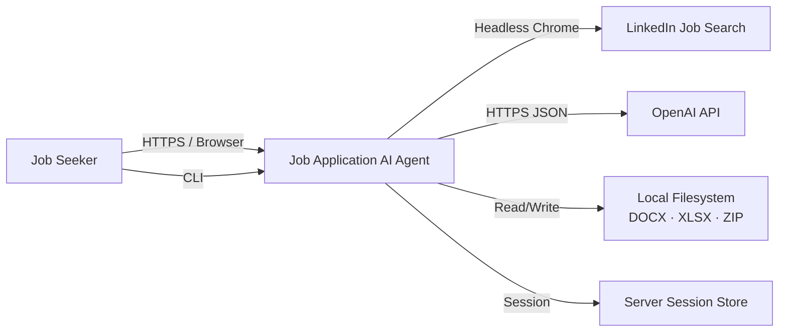
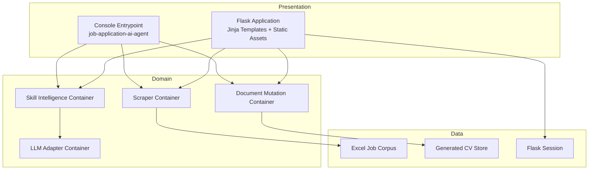
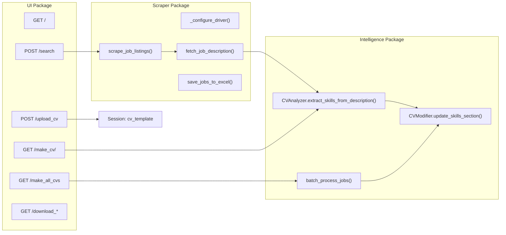
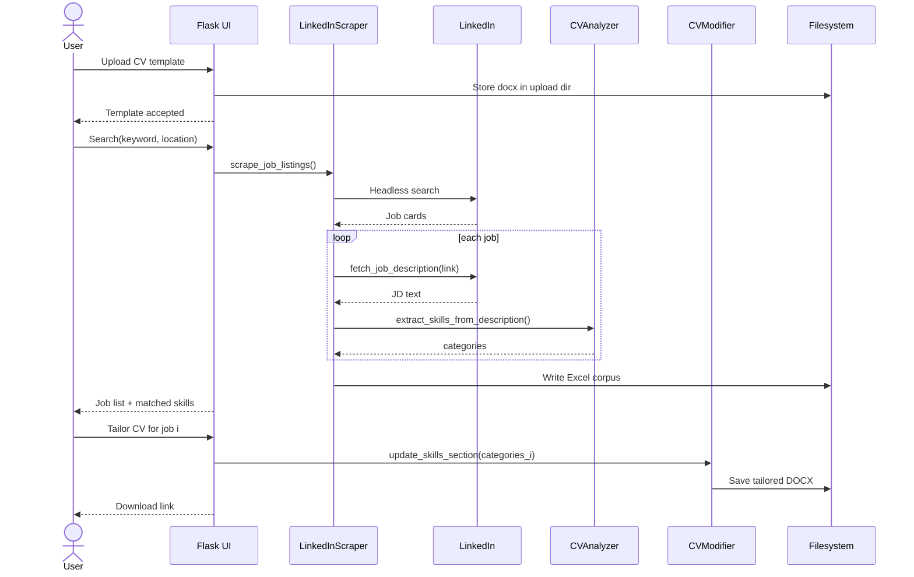
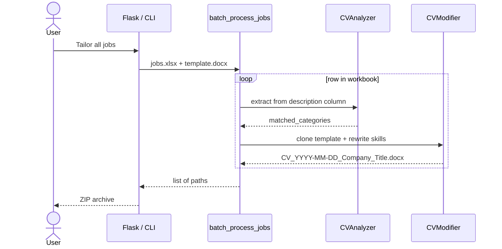

# Job Application AI Agent

### An Intelligent, End-to-End Job Discovery, Skill Intelligence, and CV Personalization Platform

**Author:** Divyanshu  
**GitHub:** [Divyanshu0230/Job-Application-AI-Agent](https://github.com/Divyanshu0230/Job-Application-AI-Agent)  
**Version:** 1.0.0  
**Domain:** Artificial Intelligence · Natural Language Processing · Intelligent Document Processing · Web Systems · Automation Engineering

---

## Abstract

Job Application AI Agent is a full-stack intelligent automation system designed to reduce the cognitive and operational load of modern job applications. The platform unifies **distributed web data acquisition**, **natural language understanding**, **skill ontology matching**, **document intelligence**, and **personalized document synthesis** into a single coherent pipeline.

A candidate typically repeats the same cycle for every vacancy: search listings, read long descriptions, extract implicit skill requirements, rewrite a CV, and produce a cover letter. This system treats that cycle as a **closed-loop information system**. It acquires live job postings from LinkedIn, normalizes unstructured job text into structured skill vectors, aligns those vectors against a multi-taxonomy skill knowledge base, and generates role-specific CV artifacts in Microsoft Word format.

The architecture is intentionally layered. A **presentation layer** (Flask web UI + CLI) sits above an **orchestration layer**, which coordinates a **data acquisition subsystem**, an **NLP / skill-intelligence subsystem**, a **document mutation subsystem**, and a **persistence / artifact-export subsystem**. The design follows classic software-engineering principles: separation of concerns, modular cohesion, loose coupling, and pipeline-oriented data flow.

This document describes the system at every abstraction level required for academic and industrial defense: problem formulation, objectives, stakeholders, high-level design (HLD), low-level design (LLD), component contracts, data models, control flow, non-functional requirements, threat model, deployment topology, and evaluation strategy.

---

## Table of Contents

1. [Problem Statement](#1-problem-statement)
2. [Motivation and Research Gap](#2-motivation-and-research-gap)
3. [Project Objectives](#3-project-objectives)
4. [Scope](#4-scope)
5. [Stakeholders and Actors](#5-stakeholders-and-actors)
6. [System Capabilities](#6-system-capabilities)
7. [Technology Stack and Design Rationale](#7-technology-stack-and-design-rationale)
8. [High-Level Architecture](#8-high-level-architecture)
9. [System Context (C4 Level 1)](#9-system-context-c4-level-1)
10. [Container Design (C4 Level 2)](#10-container-design-c4-level-2)
11. [Component Design (C4 Level 3)](#11-component-design-c4-level-3)
12. [Low-Level Design](#12-low-level-design)
13. [End-to-End Data Flow](#13-end-to-end-data-flow)
14. [Sequence Diagrams](#14-sequence-diagrams)
15. [Use Case Model](#15-use-case-model)
16. [Data Architecture](#16-data-architecture)
17. [NLP and Skill Intelligence Pipeline](#17-nlp-and-skill-intelligence-pipeline)
18. [Acquisition / Scraping Subsystem](#18-acquisition--scraping-subsystem)
19. [Document Intelligence and CV Mutation](#19-document-intelligence-and-cv-mutation)
20. [Generative Cover-Letter Subsystem](#20-generative-cover-letter-subsystem)
21. [Interface Contracts (Web + CLI)](#21-interface-contracts-web--cli)
22. [Control Flow and Orchestration](#22-control-flow-and-orchestration)
23. [Error Handling, Resilience, and Observability](#23-error-handling-resilience-and-observability)
24. [Non-Functional Requirements](#24-non-functional-requirements)
25. [Security and Privacy Design](#25-security-and-privacy-design)
26. [Deployment Architecture](#26-deployment-architecture)
27. [Repository Structure](#27-repository-structure)
28. [Setup and Execution](#28-setup-and-execution)
29. [Testing Strategy](#29-testing-strategy)
30. [Design Patterns Applied](#30-design-patterns-applied)
31. [Trade-offs and Design Decisions](#31-trade-offs-and-design-decisions)
32. [Limitations](#32-limitations)
33. [Future Work](#33-future-work)
34. [Conclusion](#34-conclusion)
35. [License](#35-license)

---

## 1. Problem Statement

The contemporary hiring market is **high-volume, keyword-gated, and ATS-mediated**. Applicant Tracking Systems rank candidates by lexical overlap between a job description and a resume. Human applicants, however, maintain one generic CV and apply to heterogeneous roles. The result is a systematic mismatch:

| Failure Mode | Effect on Candidate |
|---|---|
| Generic CV against specialized JD | Lower ATS rank |
| Manual JD reading at scale | Time cost, fatigue, missed keywords |
| Inconsistent skill language | False negatives in parser matching |
| No batch personalization | Throughput collapse as applications increase |
| Unstructured web job data | No reliable downstream automation |

Formally, the problem is:

> Given a candidate document \(C\) and a stream of job postings \(J = \{j_1, j_2, \ldots, j_n\}\), produce a set of tailored documents \(C'_i = f(C, j_i)\) that maximize skill-alignment between \(C'_i\) and \(j_i\), while preserving the structural identity of \(C\).

The system implements \(f\) as a deterministic + NLP-assisted transformation pipeline, optionally extended with a generative language model for cover-letter synthesis.

---

## 2. Motivation and Research Gap

Existing tools usually solve **one slice** of the pipeline:

- Job boards search, but do not rewrite documents.
- Resume builders format documents, but do not read live JDs.
- ChatGPT can rewrite text, but has no acquisition layer, no document object model, and no batch orchestration.
- Scrapers collect data, but do not close the loop into personalized artifacts.

This project occupies the **integration gap**: an applied AI system that is not merely a model call, but a **production-style information pipeline** with ingestion, understanding, transformation, persistence, and delivery.

---

## 3. Project Objectives

### 3.1 Primary Objectives

1. **Automate job discovery** from LinkedIn using a headless browser automation stack that can survive anti-bot controls.
2. **Normalize unstructured JD text** into structured skill, requirement, and category signals.
3. **Align extracted signals** against a multi-domain skill ontology (languages, frameworks, cloud, databases, methodologies, soft skills, analytics, and more).
4. **Mutate a canonical CV template** (`.docx`) so the skills section reflects the target role without destroying layout.
5. **Support both single-job and batch-job personalization**.
6. **Expose the pipeline** through a human-usable web interface and a scriptable CLI.

### 3.2 Secondary Objectives

- Persist intermediate job corpora as Excel workbooks for auditability.
- Package all generated CVs as a downloadable ZIP archive.
- Provide a parallel OpenAI-backed path for cover-letter generation and JD-from-URL extraction.
- Keep the codebase modular so each subsystem can be replaced independently.

### 3.3 Academic Objectives (for defense)

- Demonstrate layered architecture and C4-style system thinking.
- Show applied NLP (tokenization, entity-aware matching, taxonomy lookup).
- Show document object model manipulation (`python-docx`).
- Show orchestration of asynchronous-feeling I/O (browser automation + HTTP + file I/O) inside a synchronous web request lifecycle.
- Justify technology choices, trade-offs, and future scaling path.

---

## 4. Scope

### 4.1 In Scope

- LinkedIn job listing search by keyword + location.
- Job description retrieval and persistence.
- Skill / requirement extraction using spaCy + curated ontology.
- CV skills-section rewriting for one job or many jobs.
- Web UI for upload, search, preview, generate, download.
- CLI for scrape / tailor / batch.
- Excel export of job corpora.
- ZIP packaging of generated CVs.
- Optional OpenAI cover-letter / JD analysis path.

### 4.2 Out of Scope (current release)

- Automatic form filling on employer career portals.
- Multi-user authentication and multi-tenant storage.
- Real-time notification bus.
- Production-grade job queue (Celery / RQ) — currently request-scoped orchestration.
- Full semantic embeddings search (planned; see Future Work).

---

## 5. Stakeholders and Actors

```text
┌──────────────────┐     uses      ┌─────────────────────────────┐
│  Job Seeker      │──────────────▶│  Job Application AI Agent   │
│  (Primary Actor) │               │  (This System)              │
└──────────────────┘               └─────────────┬───────────────┘
                                                 │
                    ┌────────────────────────────┼────────────────────────────┐
                    ▼                            ▼                            ▼
           ┌────────────────┐         ┌─────────────────┐          ┌─────────────────┐
           │ LinkedIn Jobs  │         │ OpenAI API      │          │ Local Filesystem│
           │ (External Data)│         │ (Optional LLM)  │          │ (Artifacts)     │
           └────────────────┘         └─────────────────┘          └─────────────────┘
```

| Actor | Type | Interest |
|---|---|---|
| Job seeker / student | Primary | Faster, better-targeted applications |
| Evaluator / examiner | Secondary | Architectural clarity, correctness, demo |
| ATS parser (indirect) | External | Consumes generated `.docx` |
| LinkedIn | External system | Source of job postings |
| OpenAI | External system | Optional generative reasoning |

---

## 6. System Capabilities

| ID | Capability | Subsystem |
|---|---|---|
| C1 | Keyword + location job search | Scraper |
| C2 | Headless browser job-card extraction | Scraper |
| C3 | Deep JD fetch per listing | Scraper |
| C4 | Skill taxonomy matching | CVAnalyzer |
| C5 | Category aggregation | CVAnalyzer |
| C6 | DOCX skills-section rewrite | CVModifier |
| C7 | Batch CV generation | Orchestrator |
| C8 | Session-backed web workflow | Flask UI |
| C9 | Excel corpus export | Persistence |
| C10 | ZIP artifact delivery | Delivery |
| C11 | CLI automation | Application entrypoint |
| C12 | Generative cover letter (optional) | OpenAI Integration |

---

## 7. Technology Stack and Design Rationale

### 7.1 Stack Map

| Layer | Technology | Why it was chosen |
|---|---|---|
| Language | Python 3.8+ | Strong NLP + scraping + document ecosystem |
| Web framework | Flask | Minimal orchestration surface, fast to reason about in defense |
| Browser automation | Selenium + undetected-chromedriver | LinkedIn is JS-heavy and bot-resistant; static HTTP is insufficient |
| NLP | spaCy `en_core_web_sm` | Industrial NLP pipeline (tokenizer, tagger, NER) with modest hardware cost |
| Document model | python-docx | Preserves Word styles, headings, runs; not a plain-text hack |
| Tabular persistence | pandas + openpyxl | Human-auditable intermediate store |
| Optional LLM | OpenAI Python SDK | Cover-letter synthesis and JD understanding |
| HTML parsing | BeautifulSoup | URL-based JD extraction fallback |
| HTTP | requests | Lightweight I/O for non-browser sources |
| Config | python-dotenv | Secret isolation from source control |
| Packaging | setuptools console script | Clean CLI: `job-application-ai-agent` |
| Frontend | Bootstrap 5 + Jinja2 | Server-rendered, defense-demo reliable |

### 7.2 Architectural Style

The system is a **modular monolith** with **pipeline architecture**:

- One deployable process (simple operations, simple defense demo).
- Internally split into independently testable packages.
- Data moves forward through stages: Acquire → Understand → Align → Mutate → Persist → Deliver.
- Dual interface (Web + CLI) over the same domain services — a **hexagonal / ports-and-adapters** idea without over-engineering.

---

## 8. High-Level Architecture

The platform is decomposed into six logical layers.

```text
                        ┌─────────────────────────────────────────┐
                        │           PRESENTATION LAYER            │
                        │  Flask Web UI  │  CLI (argparse)        │
                        └───────────────────┬─────────────────────┘
                                            │
                        ┌───────────────────▼─────────────────────┐
                        │         ORCHESTRATION LAYER             │
                        │  Routes · Session · Batch Controller    │
                        └───────────────────┬─────────────────────┘
          ┌─────────────────────┬───────────┼───────────┬─────────────────────┐
          ▼                     ▼           ▼           ▼                     ▼
 ┌─────────────────┐  ┌─────────────────┐ ┌──────────────┐ ┌────────────────────┐
 │ ACQUISITION     │  │ INTELLIGENCE    │ │ DOCUMENT     │ │ GENERATIVE         │
 │ LinkedInScraper │  │ CVAnalyzer      │ │ CVModifier   │ │ OpenAIIntegration  │
 │ Selenium / UC   │  │ spaCy + Ontology│ │ python-docx  │ │ (optional)         │
 └────────┬────────┘  └────────┬────────┘ └──────┬───────┘ └─────────┬──────────┘
          │                    │                 │                   │
          └────────────────────┴────────┬────────┴───────────────────┘
                                        ▼
                        ┌─────────────────────────────────────────┐
                        │         PERSISTENCE & DELIVERY          │
                        │  Session · Excel · DOCX · ZIP · Logs    │
                        └─────────────────────────────────────────┘
```

### 8.1 Layer Responsibilities

**Presentation.** Captures user intent (keyword, location, CV file, job selection). Does not contain NLP or scraping logic.

**Orchestration.** The Flask routes and CLI `main()` function are coordinators, not domain experts. They sequence calls, handle errors, and map results to views or files.

**Acquisition.** Turns a search query into a list of job records with title, company, link, and full description.

**Intelligence.** Turns free-text JD into `matched_skills`, `matched_requirements`, and `matched_categories`.

**Document.** Applies the intelligence output onto a `.docx` template by locating the skills heading and rewriting that section.

**Persistence & Delivery.** Excel for jobs, DOCX for CVs, ZIP for bulk download, Flask session for conversational state across pages.

---

## 9. System Context (C4 Level 1)



The system is the single bounded context. External systems are treated as **anti-corruption boundaries**: LinkedIn HTML is never leaked into the CV writer; it is first reduced to a canonical job dictionary.

---

## 10. Container Design (C4 Level 2)



All containers currently run in-process. This is a deliberate **modular monolith** choice: same module boundaries as microservices, without network tax during a viva demo. The boundaries are the migration path if the system is later split.

---

## 11. Component Design (C4 Level 3)



### 11.1 Core Classes

| Class | Module | Responsibility |
|---|---|---|
| `LinkedInScraper` | `scraper/linkedin.py` | Browser lifecycle, listing crawl, JD fetch, Excel write |
| `CVAnalyzer` | `cv_modifier/cv_analyzer.py` | Ontology load, spaCy analysis, skill extraction |
| `CVModifier` | `cv_modifier/cv_analyzer.py` | DOCX load, heading detection, skills rewrite, save |
| `OpenAIIntegration` | `src/utils/openai_integration.py` | LLM client, JD-from-URL, generative rewrite |
| `DocumentParser` / `CVParser` | `src/parsers/document_parser.py` | Structural parse of CV/cover letter templates |
| `DocumentUpdater` | `src/updaters/document_updater.py` | Section-level document updates |
| Flask `app` | `ui/app.py` | HTTP API, session, file delivery |

---

## 12. Low-Level Design

### 12.1 Canonical Job Record

Every downstream component consumes the same in-memory contract:

```text
JobRecord = {
  "title":        str,          # listing title
  "company":      str,          # employer name
  "link":         str,          # canonical LinkedIn URL
  "description":  str,          # full JD text
  "matched_skills":      List[str],
  "matched_categories":  Dict[str, List[str]]
}
```

This is the system's **anti-corruption DTO**. Scraping quirks stay inside `LinkedInScraper`. NLP quirks stay inside `CVAnalyzer`.

### 12.2 `LinkedInScraper` — LLD

```text
LinkedInScraper
├── __init__(headless: bool)
├── _configure_driver() -> WebDriver
│     • ChromeOptions: headless, no-sandbox, UA spoofing
│     • undetected_chromedriver.Chrome
├── scrape_job_listings(keyword, location, max_jobs, max_days_old)
│     • Build search URL
│     • Wait for job-card DOM
│     • Scroll / paginate until max_jobs
│     • Emit List[JobRecord] without description
├── fetch_job_description(link) -> (title, company, description)
│     • Navigate to posting
│     • Extract main description node
└── save_jobs_to_excel(jobs, path)
      • pandas.DataFrame -> openpyxl workbook
```

**Design note for defense:** LinkedIn is a dynamic SPA. A requests+BeautifulSoup scrape would miss cards rendered by JavaScript. Selenium is required. `undetected-chromedriver` reduces fingerprint-based blocking. Headless mode enables server-side execution.

### 12.3 `CVAnalyzer` — LLD

```text
CVAnalyzer
├── nlp : spacy.Language          # en_core_web_sm
├── skill_categories : Dict[str, List[str]]
│     Programming Languages
│     Frameworks & Libraries
│     Databases
│     Cloud & DevOps
│     Tools & Platforms
│     Methodologies
│     Soft Skills
│     Languages
│     Business & Analytics
│     ... additional taxonomies
└── extract_skills_from_description(text)
      1. Lowercase + normalize
      2. spaCy tokenize / lemma-ish matching
      3. Multi-word phrase scan against ontology
      4. Return (skills, requirements, categories)
```

Matching is **ontology-first, NLP-assisted**:

- spaCy provides robust tokenization and linguistic preprocessing.
- A curated skill knowledge base provides precision (ATS cares about exact technology names).
- Category buckets make the CV rewrite semantically grouped rather than a flat keyword dump.

This is a classic **precision-oriented information extraction** design: better to emit “Python, AWS, Docker” under the correct headings than to hallucinate skills.

### 12.4 `CVModifier` — LLD

```text
CVModifier
├── __init__(cv_path)
│     Document(cv_path)     # python-docx object model
├── update_skills_section(matched_categories)
│     • Locate heading paragraph whose text ∈
│       {skills, technical skills, core competencies, expertise}
│     • Clear old skill runs under that heading
│     • Write category-wise skill lines, preserving font
└── save_modified_cv(output_path)
```

**Invariant:** only the skills region is mutated. Experience, education, and identity blocks remain intact. That is critical for a viva: the system is a **surgical document editor**, not a CV generator from scratch.

### 12.5 Flask Orchestrator — LLD (selected routes)

| Route | Method | Precondition | Postcondition |
|---|---|---|---|
| `/` | GET | none | Home rendered |
| `/search` | POST | keyword, location | jobs in session + Excel + skill tags |
| `/upload_cv` | POST | `.docx` file | `session['cv_template']` set |
| `/make_cv/<job_id>` | GET | template + jobs | one tailored DOCX |
| `/make_all_cvs` | GET | template + jobs file | N DOCX + ZIP |
| `/download_cv` | GET | generated path | file stream |
| `/download_all_cvs` | GET | generated list | ZIP stream |
| `/download_excel` | GET | jobs workbook | XLSX stream |

Error pages: `404` and `500` handlers keep the UI closed under failure.

### 12.6 CLI Command Map

```text
job-application-ai-agent
├── web     [--host] [--port] [--debug]
├── scrape  --keyword --location [--max-jobs] [--output]
├── tailor  --cv (--job | --jobs-file) [--output | --output-dir]
└── batch   --cv --jobs-file [--output-dir]
```

Web and CLI are two adapters over one domain. That is the **ports and adapters** argument in the defense.

---

## 13. End-to-End Data Flow

```text
[User Intent]
   keyword, location, max_jobs, cv.docx
              │
              ▼
     ┌─────────────────┐
     │ Search URL build│
     └────────┬────────┘
              ▼
     ┌─────────────────┐
     │ Headless Chrome │──── DOM job cards ──▶ JobRecord[] (shallow)
     └────────┬────────┘
              ▼
     ┌─────────────────┐
     │ JD deep fetch   │──── description text
     └────────┬────────┘
              ▼
     ┌─────────────────┐
     │ Excel snapshot  │──── audit corpus
     └────────┬────────┘
              ▼
     ┌─────────────────┐
     │ spaCy + Ontology│──── matched_categories
     └────────┬────────┘
              ▼
     ┌─────────────────┐
     │ DOCX mutation   │──── Tailored_CV_{date}_{company}_{title}.docx
     └────────┬────────┘
              ▼
     ┌─────────────────┐
     │ ZIP / Download  │──── user delivery
     └─────────────────┘
```

**Information monotonically enriches** as it moves right. Shallow listings become deep JDs, become skill vectors, become documents. No stage needs to re-scrape if a later stage fails; Excel is the replay buffer.

---

## 14. Sequence Diagrams

### 14.1 Single-job tailoring (happy path)



### 14.2 Batch generation



---

## 15. Use Case Model

```text
                    ┌─────────────────────────────┐
                    │      Job Seeker             │
                    └──────────────┬──────────────┘
                                   │
        ┌──────────────┬───────────┼───────────┬──────────────┐
        ▼              ▼           ▼           ▼              ▼
   UC1 Upload    UC2 Search   UC3 Inspect  UC4 Tailor   UC5 Download
   CV template   jobs         JD + skills  one / all    DOCX / ZIP / XLSX
```

| ID | Use Case | Main Success Scenario |
|---|---|---|
| UC1 | Upload CV | User submits `.docx`; server validates type; path stored in session |
| UC2 | Search jobs | Query → scrape → JD fetch → skill tag → job table |
| UC3 | Inspect job | User opens a row; sees description and matched categories |
| UC4 | Tailor one | Analyzer + modifier run; one file written |
| UC5 | Tailor all | Batch processor writes N files and a ZIP |
| UC6 | Export jobs | Excel workbook downloaded for offline audit |
| UC7 | CLI scrape | Non-interactive corpus collection |
| UC8 | CLI batch | CI-style generation from an existing workbook |

---

## 16. Data Architecture

There is no obligatory RDBMS in v1. Persistence is **artifact-oriented**, which matches the domain (documents, not transactions).

### 16.1 Logical stores

| Store | Format | Lifetime | Purpose |
|---|---|---|---|
| Flask session | server-side dict | request conversation | `jobs`, `cv_template`, `processed_jobs` |
| Job corpus | `.xlsx` | durable | replay, audit, CLI batch |
| CV template | `.docx` | durable (upload dir) | source of truth for identity/layout |
| Tailored CVs | `.docx` | durable (output dir) | deliverable |
| Bundle | `.zip` | ephemeral download | bulk delivery |
| Logs | stdout / file | operational | tracing scraper/NLP failures |

### 16.2 Excel schema (job corpus)

| Column | Type | Source |
|---|---|---|
| title | string | listing card |
| company | string | listing card |
| link | URL | listing card |
| description | long text | posting page |

### 16.3 File naming convention

```text
CV_{YYYY-MM-DD}_{SanitizedCompany}_{SanitizedTitle}.docx
linkedin_jobs_{YYYY-MM-DD}.xlsx
```

Sanitization removes Windows/macOS illegal path characters (`\\ / * ? : " < > |`) via `sanitize_filename()`.

### 16.4 Why not a database yet?

For a single-user desktop/server demo, files are the correct store:

- Excel is inspectable by a non-engineer examiner.
- DOCX is the actual product.
- Introducing PostgreSQL would add ops cost without improving the core thesis.

A later multi-user SaaS would add: `users`, `templates`, `jobs`, `runs`, `artifacts` tables and object storage. The module boundaries already anticipate that.

---

## 17. NLP and Skill Intelligence Pipeline

```text
Raw JD
  │
  ├─▶ Unicode normalize / lowercase
  ├─▶ spaCy pipeline (tok2vec → tagger → parser → NER)
  ├─▶ Candidate span generation (unigrams + multiword phrases)
  ├─▶ Ontology lookup (hash / contains match per category)
  ├─▶ Deduplicate
  └─▶ Bucket into matched_categories
           │
           ▼
     Programming Languages: [python, sql]
     Cloud & DevOps:        [aws, docker]
     Soft Skills:           [communication, problem solving]
```

### 17.1 Why a hybrid (rules + NLP) instead of a pure LLM?

| Criterion | Ontology + spaCy | Pure LLM |
|---|---|---|
| Cost per job | ~0 | token fees |
| Determinism | high | variable |
| Hallucinated skills | rare | common |
| Offline demo | yes | needs key + network |
| ATS keyword precision | excellent | unpredictable |
| Cover letter prose | weak | excellent |

The system therefore uses **symbolic AI for skills** and **generative AI (optional) for prose**. That dual-mode design is a strong defense talking point: the right model for the right job.

### 17.2 Ontology as knowledge graph (logical)

Each category is a node; each skill is a leaf. Matching is a bipartite assignment:

```text
JD tokens  ──── matches ────  Ontology leaves  ──── belong to ────  Categories
```

The CV writer then serializes categories as labeled blocks, which is closer to how humans and ATS parsers both read a skills section.

---

## 18. Acquisition / Scraping Subsystem

### 18.1 Constraints of the source

LinkedIn job search is:

- Client-rendered (JavaScript).
- Rate-aware.
- Fingerprint-aware.
- Structurally unstable (class names change).

### 18.2 Mitigations implemented

| Risk | Mitigation |
|---|---|
| JS rendering | Selenium WebDriver |
| Bot fingerprint | undetected-chromedriver |
| Headless detection | realistic window size + user-agent |
| Empty result set | user-facing flash warning, no crash |
| Partial JD | per-job try/log and continue |
| Recursion of requests | `max_jobs` hard cap |
| Stale postings | `max_days_old` window |

### 18.3 Acquisition SLA (design target)

- Search page load wait with explicit WebDriverWait.
- Per-job isolation: one failed JD does not abort the corpus.
- Corpus is checkpointed to Excel immediately after listing + after descriptions.

---

## 19. Document Intelligence and CV Mutation

### 19.1 Document Object Model

A `.docx` file is a ZIP of XML. `python-docx` exposes:

```text
Document
 └─ paragraphs[]
      ├─ style (Heading 1, Normal, ...)
      └─ runs[]  (font, size, bold)
```

The modifier walks paragraphs, detects a skills heading by lexical cues, then rewrites subsequent content until the next heading. This is **structure-aware editing**, not regex-on-XML.

### 19.2 Safety properties

1. **Identity preservation** — name, contact, education remain.
2. **Style preservation** — fonts copied from neighboring runs.
3. **Fail-closed** — if no skills heading is found, the operation reports failure instead of corrupting a random section.
4. **Clone-per-job** — batch mode never overwrites the original template.

---

## 20. Generative Cover-Letter Subsystem

A parallel package (`Automatic CV and Cover Letter with API`) extends the core agent:

```text
URL or pasted JD
        │
        ▼
 OpenAIIntegration.extract_job_description_from_url()
        │
        ▼
 LLM analysis of required skills / tone / seniority
        │
        ├──▶ DocumentUpdater  ──▶ tailored CV sections
        └──▶ DocumentUpdater  ──▶ tailored cover letter
```

This subsystem is the **probabilistic complement** to the deterministic skill rewriter. In defense terms:

- Core agent = **reliable, explainable, ontology-grounded**.
- LLM adapter = **fluent, context-rich, optional**.

API keys never live in source. They enter through environment variables (`OPENAI_API_KEY`) via `python-dotenv`.

---

## 21. Interface Contracts (Web + CLI)

### 21.1 Web interaction contract

```text
Browser  --POST multipart-->  /upload_cv     (application/vnd.openxmlformats)
Browser  --POST form------->  /search        (keyword, location, max_jobs)
Browser  --GET------------->  /make_cv/{id}
Browser  --GET------------->  /make_all_cvs
Browser  --GET------------->  /download_cv | /download_all_cvs | /download_excel
```

State is conversational and server-owned (session), so the UI can remain multi-page without a SPA framework.

### 21.2 CLI interaction contract

```bash
job-application-ai-agent scrape  --keyword "Software Engineer" --location "Remote" --max-jobs 5
job-application-ai-agent tailor  --cv template.docx --job jd.txt
job-application-ai-agent batch   --cv template.docx --jobs-file jobs.xlsx
job-application-ai-agent web     --port 5001
```

The CLI is the **automation port** for examiners who want to see the pipeline without the browser.

---

## 22. Control Flow and Orchestration

```text
                    main()
                      │
        ┌─────────────┼─────────────┬─────────────┐
        ▼             ▼             ▼             ▼
       web         scrape        tailor         batch
        │             │             │             │
        ▼             ▼             ▼             ▼
     Flask app    Scraper      Analyzer+     batch_process
     event loop   + Excel      Modifier      jobs()
```

Lazy imports inside command branches avoid circular imports and keep CLI startup light when only `scrape` is needed. That is a small but real **modularity / performance** point.

Web orchestration is **synchronous request-scoped**. For a demo this is honest and explainable. For production, the same functions would be submitted to a task queue; the function signatures already allow that because they are pure-ish domain calls.

---

## 23. Error Handling, Resilience, and Observability

| Layer | Failure | Handling |
|---|---|---|
| Upload | missing / non-docx | flash error, stay on page |
| Search | empty result | warning, redirect home |
| Search | scraper exception | log + user flash |
| JD fetch | timeout / missing node | log, continue other jobs |
| spaCy model missing | OSError | auto-download `en_core_web_sm` |
| Skills heading missing | modifier false | error log, no silent corrupt |
| Unknown route | 404 template | branded error |
| Unhandled | 500 template | branded error |
| Logging | everywhere | timestamped `logging` module |

Observability is currently **structured logs**, which is appropriate for a single-node academic system. Metrics / tracing are listed under Future Work.

---

## 24. Non-Functional Requirements

### 24.1 Functional quality attributes

| Attribute | Target | Mechanism |
|---|---|---|
| Usability | Non-engineer can run the happy path | Web UI + flash messages |
| Modularity | Subsystems independently replaceable | package boundaries |
| Explainability | Why a skill appeared | ontology membership, not black box |
| Reproducibility | Same JD → same skill set | deterministic matcher |
| Portability | macOS / Linux / Windows | Python venv + install scripts |
| Auditability | Trace who was generated for what | Excel + filename convention |

### 24.2 Performance profile (qualitative)

- Bottleneck: LinkedIn navigation (network + Chromium), not NLP.
- spaCy `sm` model is CPU-friendly.
- Batch cost is roughly linear in `max_jobs`.
- Cap `max_jobs` (UI default 5, max 20) as a **back-pressure control**.

### 24.3 Scalability path

```text
v1  Modular monolith, sync Flask, local disk
v2  Task queue (RQ/Celery) + object storage
v3  Multi-user auth, Postgres, per-user isolation
v4  Embedding index + recommendation of jobs, not only rewrite
```

---

## 25. Security and Privacy Design

Candidate CVs are **PII**. The design treats them as sensitive artifacts.

| Control | Implementation |
|---|---|
| Secret isolation | `OPENAI_API_KEY`, `SECRET_KEY` via environment |
| Upload allow-list | `.docx` only |
| Filename sanitization | strip path metacharacters |
| Session secret | Flask `SECRET_KEY` |
| No credential scraping | LinkedIn public job search, not inbox/login automation in the happy path |
| Local-first storage | files on the operator machine, not a public bucket |
| Dependency hygiene | venv isolation |

Defense note: this is a **personal productivity agent**, not a credential-stuffing tool. Scope stays on public job text + the user’s own CV.

---

## 26. Deployment Architecture

```text
┌──────────────────────────────────────────────┐
│                 Operator Host                │
│  ┌────────────┐   ┌────────────┐             │
│  │ Python 3.12│   │ Chrome     │             │
│  │ venv       │   │ + driver   │             │
│  └─────┬──────┘   └─────┬──────┘             │
│        │                │                    │
│        ▼                ▼                    │
│  ┌────────────────────────────────────────┐  │
│  │ job-application-ai-agent  (Flask)      │  │
│  │ 0.0.0.0:5001                           │  │
│  └────────────────────────────────────────┘  │
│        │                                     │
│        ├── static/  bootstrap local assets   │
│        ├── templates/                        │
│        └── outputs/  jobs + cvs              │
└──────────────────────────────────────────────┘
        │
        ├── Internet ──▶ LinkedIn
        └── Internet ──▶ OpenAI (optional)
```

**macOS note:** port 5000 is commonly occupied by AirPlay Receiver. Bind Flask to **5001** in that environment.

Install path:

```bash
./install.sh          # venv + requirements + spaCy model + editable install
source venv/bin/activate
job-application-ai-agent web --port 5001
```

---

## 27. Repository Structure

```text
Job-Application-AI-Agent/
├── README.md                          ← this architecture document
├── LICENSE                            ← MIT, Author: Divyanshu
├── setup.py                           ← package metadata + console script
├── requirements.txt                   ← runtime dependencies
├── install.sh / install.bat           ← one-command environment bootstrap
├── TESTING_GUIDE.md
├── test_batch_processing.py           ← end-to-end batch smoke path
├── scraping.ipynb                     ← research / exploratory acquisition
├── job_application_ai_agent/          ← core product package
│   ├── __init__.py                    ← version, author
│   ├── __main__.py                    ← CLI orchestrator
│   ├── scraper/
│   │   └── linkedin.py                ← acquisition subsystem
│   ├── cv_modifier/
│   │   └── cv_analyzer.py             ← intelligence + document mutation
│   ├── utils/
│   │   └── helpers.py                 ← shared I/O, sanitization
│   └── ui/
│       ├── app.py                     ← Flask orchestrator
│       ├── templates/                 ← presentation views
│       └── static/                    ← local CSS/JS (CDN-independent)
└── Automatic CV and Cover Letter with API/
    ├── src/parsers/                   ← document structural parse
    ├── src/updaters/                  ← section rewrite
    └── src/utils/openai_integration.py
```

---

## 28. Setup and Execution

### 28.1 Prerequisites

- Python 3.8+
- Google Chrome
- (Optional) OpenAI API key

### 28.2 Install

```bash
git clone https://github.com/Divyanshu0230/Job-Application-AI-Agent.git
cd Job-Application-AI-Agent
./install.sh
source venv/bin/activate
```

### 28.3 Run the web system

```bash
job-application-ai-agent web --port 5001
```

Open `http://127.0.0.1:5001`

### 28.4 Operator workflow (demo script for viva)

1. Upload a `.docx` CV that contains a **Skills** heading.
2. Search: Job Title = `Software Engineer`, Location = `Remote`, Jobs = `5`.
3. Wait for scrape + JD fetch + skill tagging.
4. Inspect matched categories on the listing page.
5. Generate one CV, download, open in Word, show the skills delta.
6. Generate all CVs, download ZIP, show naming convention.

---

## 29. Testing Strategy

Testing is staged to match the architecture.

| Level | What | How |
|---|---|---|
| Unit | `sanitize_filename`, ontology match | pure functions |
| Component | `CVAnalyzer` on fixture JDs | assert category membership |
| Component | `CVModifier` on fixture docx | assert skills heading changed |
| Integration | scrape → excel | `test_batch_processing.py` |
| System | Flask happy path | manual / browser |
| Acceptance | viva demo script above | examiner-visible |

Known test command:

```bash
./test_batch_processing.py --cv path/to/cv_template.docx
```

---

## 30. Design Patterns Applied

| Pattern | Where | Purpose |
|---|---|---|
| Layered architecture | UI / domain / persistence | defense-scale structure |
| Pipeline | scrape → NLP → mutate → save | clear data flow |
| Facade | CLI `main()` and Flask routes | hide subsystem complexity |
| Strategy (latent) | ontology matcher vs LLM adapter | interchangeable intelligence |
| DTO | `JobRecord` dict | stable contract |
| Template Method | document parsers (`CVParser`, `CoverLetterParser`) | shared parse skeleton |
| Adapter | OpenAI SDK wrapped by `OpenAIIntegration` | isolate vendor API |
| Dependency isolation | lazy imports in CLI | avoid circular import / heavy startup |

---

## 31. Trade-offs and Design Decisions

| Decision | Chosen | Rejected | Why |
|---|---|---|---|
| Architecture | Modular monolith | Microservices | Demo complexity, no independent scaling need yet |
| Web framework | Flask | Django / FastAPI | Thin orchestration, Jinja is enough |
| JD acquisition | Selenium | Raw HTTP | JS-rendered source |
| Skill extraction | Ontology + spaCy | Embeddings only | Explainability + zero inference cost |
| Cover letters | Optional LLM | Always-on LLM | Cost, offline viva, hallucination control |
| Persistence | Files + session | PostgreSQL | Artifact domain, examiner-readable |
| Frontend | Server-rendered | React SPA | Reliability in defense, less moving parts |
| Static assets | Local Bootstrap | CDN | Preview/sandbox environments block CDNs |

Every rejected option is still compatible with the module map. That is how you answer “what would you change in production?”

---

## 32. Limitations

1. LinkedIn DOM changes can break selectors — acquisition is the most brittle layer.
2. Request-scoped scraping can exceed HTTP timeouts for large `max_jobs`.
3. Skill coverage equals ontology coverage; unknown tools require taxonomy updates.
4. CV rewrite currently concentrates on the skills section, not bullet-level experience rewriting.
5. Single-operator session model; not a multi-tenant SaaS.
6. Generative path requires an external paid API and network.

These are framed as **known, scheduled limitations**, not surprises.

---

## 33. Future Work

| Horizon | Upgrade | Architectural impact |
|---|---|---|
| Near | Background job queue | Orchestration layer becomes async |
| Near | Embedding similarity (MiniLM) | Intelligence layer gains semantic recall |
| Mid | Experience-bullet rewriting | Document layer becomes section-complete |
| Mid | User accounts + encrypted template store | Persistence becomes multi-tenant |
| Mid | Selector self-healing / Playwright | Acquisition robustness |
| Far | Recommendation of *which* jobs to apply to | New decision-intelligence bounded context |
| Far | ATS score simulator | Closed-loop optimization of \(C'_i\) |

---

## 34. Conclusion

Job Application AI Agent is not a single script. It is a **layered intelligent system** that treats job applications as a data-processing problem:

1. **Acquire** unstructured market data.
2. **Understand** it with NLP and a skill ontology.
3. **Align** it to a candidate document model.
4. **Emit** ATS-aware, role-specific artifacts.
5. **Deliver** them through both a human UI and a machine CLI.

The high-level design is a pipeline-shaped modular monolith. The low-level design is a small set of cohesive classes (`LinkedInScraper`, `CVAnalyzer`, `CVModifier`, Flask orchestrator, optional `OpenAIIntegration`) bound by a canonical `JobRecord` contract. The system is explainable, demoable, and extensible — which is the correct shape for an academic defense and for later production growth.

---

## 35. License

MIT License © 2026 **Divyanshu**

Repository: [https://github.com/Divyanshu0230/Job-Application-AI-Agent](https://github.com/Divyanshu0230/Job-Application-AI-Agent)
